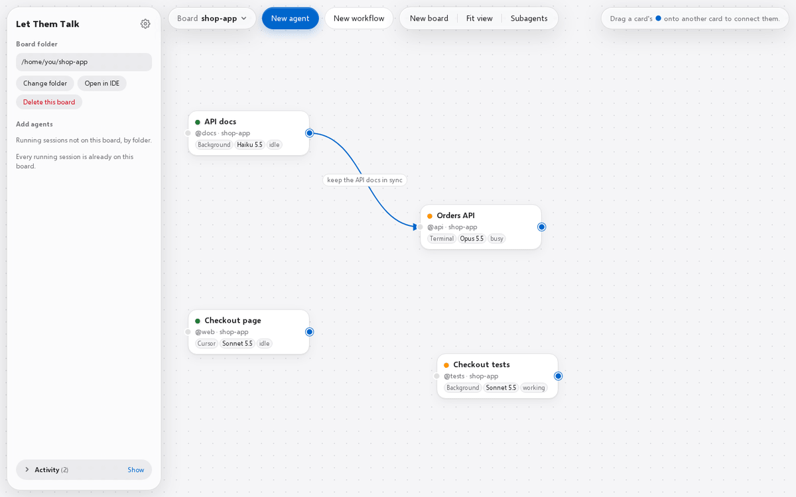

# Let Them Talk

A visual board for your agents. Each running Claude Code session is a card, and an arrow from one card to another tells both chats who they work with and why.

## What it does

- Draw an arrow between two chats and it tells them who to talk to and why. They then talk through Claude Code's own messaging.
- Click an arrow to read what the two chats sent each other.
- Start a team: a master and up to 8 agents, each with its own role, prompt, model and effort.
- Terminal chats, Cursor chats and background agents share one board, with the subagents they run.
- Local and small: the server is one Python file that uses only Python's standard library, and nothing is installed into Claude Code.

## Start

Needs Python 3.12+ and Claude Code (on Windows, both inside WSL).

- Windows: double-click `Start Let Them Talk.bat`.
- macOS, Linux, WSL: `./start.sh`, then open <http://localhost:8765>.

Click **New board** and pick a project folder: its running chats appear as cards. Drag the blue handle from one card onto another, then click **Connect**.

More: [using it](docs/usage.md) · [how it works](docs/how-it-works.md) · [settings](docs/configuration.md) · [limits](docs/limits.md)

Not related to [Dekelelz/let-them-talk](https://github.com/Dekelelz/let-them-talk), a different project with the same name.

## License

[Apache 2.0](LICENSE). The Selawik font and the `/handoff` skill keep their own licenses, next to their files.
